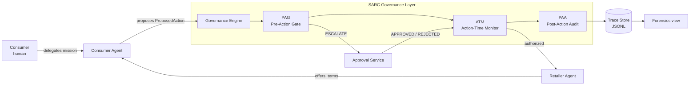

# Governed Agentic Commerce Control Tower

This repository demonstrates how a consumer can delegate shopping tasks to an AI agent without delegating accountability.

It is a reference implementation of a SARC-style runtime governance layer for delegated commerce. Governance is enforced at explicitly wrapped action boundaries only. The repository is a simulated environment, not a production-certified commerce system, and is not a universal governance layer for arbitrary agents or frameworks. The goal is to demonstrate a runtime governance pattern in which delegated action is intercepted, evaluated, escalated, and evidenced before any consequential effect leaves the consumer-agent boundary.

## 1. Problem

Consumer-facing AI agents will increasingly act on behalf of shoppers and transact with retailer-side AI agents. Each consequential step — selecting a merchant, sharing consumer data, accepting a substitute, applying a promotion, placing an order, charging a payment token — happens at machine speed. The traditional controls that bound human transactions (a checkout page, an email confirmation, a chargeback flow) were not designed for delegated action and do not survive contact with agent-to-agent commerce.

Delegated action without runtime control is not "automation". It is unaccountable action.

## 2. Why this matters

A consumer who delegates a shopping mission has not waived their authority — they have bounded it. Acceptable budget, acceptable retailers, acceptable substitutions, acceptable data disclosure, and acceptable terms are all present in the delegation. The runtime stack must respect those bounds, generate evidence when they are reached, and refuse to silently exceed them. Anything less makes agentic commerce un-disputable, un-auditable, and un-insurable.

## 3. SARC design principles

This repository follows the SARC philosophy explicitly. Governance is about controlling action under delegated authority, not pretending to govern all cognition.

1. **Governance at the action boundary.** Governance sits between agent intent and consequential action. It does not attempt to govern the agent's internal reasoning. Only wrapped action boundaries are enforced.
2. **Mandatory governance path.** No consequential action may execute outside the governance layer. The consumer agent has no direct path to retailer-side side effects. There is no `force_execute` or `skip_governance` API.
3. **PAG / ATM / PAA.** Every governed action runs Pre-Action Gate → Action-Time Monitor → Post-Action Audit. Each stage has a single, narrow responsibility.
4. **Default deny / safe failure.** Missing facts, malformed policy inputs, unknown action types, and unhandled rule kinds default to BLOCK or ESCALATE. The engine never silently allows.
5. **Consequence-focused governance.** Only consequential actions are governed (eight action types). Internal ranking, filtering, and reasoning are deliberately outside scope.
6. **Evidence-first design.** Every governed action produces a structured `DecisionRecord` and a sequenced `TraceEvent`. The trace is the canonical artifact, not the chat log.
7. **Honest scoping.** This is a simulated, pre-production reference implementation. It does not prove full security or legal sufficiency.

## 4. Architecture



Module map:

| Concern | Module |
| --- | --- |
| Domain models | `src/gacct/domain/` |
| Policy packs (YAML) and evaluator | `policies/`, `src/gacct/policy/` |
| Governance trio + mandatory gateway | `src/gacct/governance/` |
| Consumer & retailer agents | `src/gacct/agents/` |
| Approval service | `src/gacct/approvals/` |
| Trace store | `src/gacct/trace/` |
| Scripted scenarios | `src/gacct/scenarios/` |
| Streamlit UI (control room) | `app/streamlit_app.py` |
| Tests | `tests/` |

See [`docs/architecture.md`](docs/architecture.md) for the detailed responsibilities and the SARC mapping.

## 5. Scenario

The flagship scenario is a half-marathon shoe purchase delegated by consumer "Eva" to her personal shopping agent. The delegation captures:

> Buy running shoes for a half marathon within 180 EUR, from approved retailers only, no leather products, delivery within 3 days, substitution only within 10 percent price variance, no auto-purchase above 150 EUR, and no sharing of personal data beyond shipping details and payment token.

These bounds map directly to the policy packs in `policies/`. The scenarios in `src/gacct/scenarios/` exercise the boundary cases.

## 6. How to run

The demo runs locally without any API keys. No external LLM is called.

```bash
# 1. Install
pip install -e ".[dev]"

# 2. Run tests
make test

# 3. Generate example traces for all scripted scenarios
make scenarios   # writes examples/traces/*.jsonl

# 4. Launch the control-room UI
make run         # streamlit run app/streamlit_app.py
```

Then open the URL Streamlit prints (default `http://localhost:8501`) and use the sidebar to switch scenarios.

## 7. Demo paths

Four scripted scenarios ship in `src/gacct/scenarios/`:

1. **`happy_path`** — approved retailer, compliant product, within budget, acceptable shipping, no excessive data sharing. Every governed action is ALLOW.
2. **`escalation_path`** — retailer proposes a substitute outside the 10% tolerance, and the resulting total exceeds the auto-buy threshold. PAG escalates twice; the scripted approval policy approves; the order proceeds.
3. **`blocked_path`** — three independent BLOCKs: selecting an unapproved retailer, sharing data with a retailer asking for fields outside the whitelist, and accepting a 3-day return window when the minimum is 14.
4. **`conditional_path`** — a loyalty promotion reduces total spend but requires marketing consent. The promotions pack returns ALLOW_WITH_CONDITIONS; the consumer's explicit `loyalty_enrollment_accepted` flag is the condition.

Each path is replayable from `examples/traces/`.

## 8. What this proves

- Runtime governance over delegated commerce action is implementable today with a small, inspectable rule surface.
- A consumer agent can be structurally prevented from acting outside an explicit governance path.
- ALLOW / BLOCK / ESCALATE / ALLOW_WITH_CONDITIONS is a sufficient verdict surface to handle the realistic governance moments in this scenario.
- Every consequential action can be evidenced with enough structure to support dispute and audit.

## 9. What this does not prove

- This does **not** prove full security or legal sufficiency for any jurisdiction.
- This does **not** govern model cognition — only wrapped action boundaries.
- This does **not** integrate with any real retailer, payment processor, or fulfilment system. The retailer agent and confirmation flow are simulated.
- The trace's hash chain is a demo mechanism, not production-grade non-repudiation.
- This is **not** a universal agent governance layer. It governs the actions enumerated in `ActionType`.

For the full caveat list, read [`docs/risk-and-limitations.md`](docs/risk-and-limitations.md) and [`docs/self-review.md`](docs/self-review.md).

## 10. Roadmap

Plausible next steps if this pattern were to be hardened toward pre-production:

- Pluggable policy evaluators and a richer rule-kind catalogue.
- A real out-of-band approval channel (push notification, signed callback).
- Signed decision records with an external timestamp authority.
- A retailer-side adapter pattern for real commerce APIs, isolated by the same engine boundary.
- Per-mission policy bundling and versioned mission contracts.
- Adversarial tests for prompt-injection that would try to steer the consumer agent into proposing harmful actions; the governance layer should still hold.

## 11. Repository structure

```
.
├── README.md
├── pyproject.toml
├── requirements.txt
├── Makefile
├── app/
│   └── streamlit_app.py
├── policies/                       # versioned YAML policy packs
│   ├── auto_buy.yaml
│   ├── budget.yaml
│   ├── data_sharing.yaml
│   ├── delivery.yaml
│   ├── materials.yaml
│   ├── promotions.yaml
│   ├── retailers.yaml
│   ├── returns.yaml
│   └── substitution.yaml
├── examples/
│   └── traces/                     # checked-in scenario traces
│       ├── happy_path.jsonl
│       ├── escalation_path.jsonl
│       ├── blocked_path.jsonl
│       └── conditional_path.jsonl
├── src/gacct/
│   ├── agents/                     # consumer & retailer simulated agents
│   ├── approvals/                  # ApprovalService + scripted policy
│   ├── domain/                     # pydantic domain models
│   ├── governance/                 # engine, PAG, ATM, PAA
│   ├── policy/                     # loader + rule evaluator
│   ├── scenarios/                  # scripted demo paths + runner
│   └── trace/                      # JSONL trace store
├── tests/                          # 32 tests across pag, engine, scenarios, trace store, bypass
└── docs/
    ├── architecture.md
    ├── narrative-demo-script.md
    ├── operating-model-note.md
    ├── risk-and-limitations.md
    └── self-review.md
```

## Screenshots

Run the app locally (`make run`) and you'll see five tabs: **Mission**, **Agent network**, **Ledger**, **Cockpit**, **Forensics**. A screenshot pass is left as a follow-up so the published image set reflects the exact render of whoever runs the demo.
