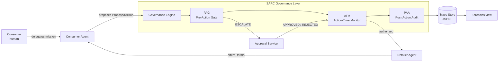

# Governed Agentic Commerce Control Tower

[](https://ecommerce-agentic.streamlit.app/)

**Live demo:** <https://ecommerce-agentic.streamlit.app/>

This repository demonstrates how a consumer can delegate shopping tasks to an AI agent without delegating accountability.

Agentic AI can execute a consumer's mission end-to-end - but only if it operates on curated, contextualized consumer data, and only if its delegated authority is bounded by a runtime governance layer. This repository demonstrates all three: autonomous agentic action, structured consumer context as the data foundation, and SARC-style governance as the accountability layer. Governance is enforced at explicitly wrapped action boundaries only. The repository is a simulated environment, not a production-certified commerce system, and is not a universal governance layer for arbitrary agents or frameworks. The goal is to demonstrate a runtime pattern in which a capable agent, operating on a versioned data foundation, has its delegated action intercepted, evaluated, escalated, and evidenced before any consequential effect leaves the consumer-agent boundary.

## 1. Problem

Three forces are arriving together, and they only work in combination.

**Agentic capability.** Consumer-facing AI agents can now walk a complete mission - search merchants, evaluate offers, negotiate terms with retailer-side agents, propose substitutes, request promotions, place orders, charge payment tokens, renew subscriptions, cancel services - at machine speed and without human attention at each step. That is the power of agentic AI.

**Contextual data.** Capable autonomy is only as good as the structured data the agent operates on. The consumer's delegation parameters (budget ceilings, approved merchants, substitution tolerances, data-sharing whitelists), the agent's last-known facts (today's price for each subscription, current billing period, last-confirmed approved-services version), and the explicit forbidden lists are not metadata - they are the data foundation. A capable agent operating on stale, missing, or unstructured context is blind or dangerous; the agent might renew at last week's price, accept yesterday's terms, or share fields the consumer never authorized.

**Governance.** Even with full autonomy and pristine data, delegated action without a runtime control layer is unaccountable. The traditional human controls (a checkout page, an email confirmation, a chargeback flow) were not designed for agent-to-agent commerce. A consumer who delegates has not waived authority - they have bounded it. Without a runtime layer that enforces those bounds, agentic commerce is un-disputable, un-auditable, and un-insurable.

Delegated action without all three - capability, context, control - is not "automation". It is unaccountable action against a moving target.

## 2. Why this matters

The three pillars are not optional, and they are not interchangeable.

**Agentic AI without curated data produces wrong or harmful actions.** A capable agent operating on a stale baseline will renew at a price that has silently jumped past the consumer's ceiling, accept a billing-period change the consumer never agreed to, or extend authority to a service the consumer has never seen. The governance layer can only do its job when the data it evaluates against is itself complete and fresh. Stale context is itself a governance failure mode; this demo treats it as such with a pre-PAG `DataContextValidator` that refuses to govern an action whose foundation is incomplete.

**Curated data without governance produces unaccountable action.** Even a perfectly clean ConsumerContext is not a control. Knowing the budget ceiling does not enforce it; knowing the substitution tolerance does not bound it. Data on its own is just an information advantage. Without a runtime layer that mediates intent and execution, the agent can transact at the speed of light against rules nobody ever checked.

**Only the combination produces delegated action that is powerful, correct, AND accountable.** A capable agent over a curated, versioned ConsumerContext, gated by a runtime governance layer (PAG → ATM → PAA) that allows, blocks, escalates, or conditionally allows each consequential step, is the minimum unit that scales. Every decision record carries `context_id` and `context_version` so an auditor - or a dispute reviewer, or an insurer - can replay exactly which data baseline was in effect when the agent acted. The shopping scenarios in this repository demonstrate the governance pillar. The subscription-renewal scenario demonstrates all three side-by-side: agentic portfolio sweep, versioned consumer context with deliberately stale records, and seven governance moments that each fail or succeed for a structurally different reason.

## 3. SARC design principles

This repository follows the SARC philosophy explicitly. Governance is about controlling action under delegated authority, not pretending to govern all cognition.

1. **Governance at the action boundary.** Governance sits between agent intent and consequential action. It does not attempt to govern the agent's internal reasoning. Only wrapped action boundaries are enforced.
2. **Mandatory governance path.** No consequential action may execute outside the governance layer. The consumer agent has no direct path to retailer-side side effects. There is no `force_execute` or `skip_governance` API.
3. **PAG / ATM / PAA.** Every governed action runs Pre-Action Gate → Action-Time Monitor → Post-Action Audit. Each stage has a single, narrow responsibility.
4. **Default deny / safe failure.** Missing facts, malformed policy inputs, unknown action types, and unhandled rule kinds default to BLOCK or ESCALATE. The engine never silently allows.
5. **Consequence-focused governance.** Only consequential actions are governed (eight action types). Internal ranking, filtering, and reasoning are deliberately outside scope.
6. **Evidence-first design.** Every governed action produces a structured `DecisionRecord` and a sequenced `TraceEvent`. The trace is the canonical artifact, not the chat log.
7. **Honest scoping.** This is a simulated, pre-production reference implementation. It does not prove full security or legal sufficiency.

## 4. Architecture



Module map:

| Concern | Module |
| --- | --- |
| Domain models | `src/gacct/domain/` |
| Policy packs (YAML) and evaluator | `policies/`, `src/gacct/policy/` |
| Governance trio + mandatory gateway | `src/gacct/governance/` |
| Consumer & retailer agents | `src/gacct/agents/` |
| Approval service | `src/gacct/approvals/` |
| Trace store | `src/gacct/trace/` |
| Scripted scenarios | `src/gacct/scenarios/` |
| Streamlit UI (control room) | `app/streamlit_app.py` |
| Tests | `tests/` |

See [`docs/architecture.md`](docs/architecture.md) for the detailed responsibilities and the SARC mapping.

## 5. Scenario

The demo is a **subscription portfolio renewal** delegated by consumer "Eva" to her personal agent. It is intentionally the only end-to-end scenario, because it exercises all three pillars in a single mission - agentic portfolio sweep, versioned ConsumerContext with deliberately stale records, and seven distinct governance moments across Eva's real-world subscriptions. The delegation captures:

> Renew my active subscriptions up to 15 EUR/month automatically; escalate renewals between 15-30 EUR; block anything above 30 EUR or any new service I have not pre-approved. No sharing of payment data beyond token and billing email. Cancel if the renewal silently changes billing period.

Eva's portfolio: **Netflix, Spotify Premium, DAZN Total, Apple TV+, Amazon Prime, Disney+**, plus a billing-aggregator called BundleSavvy. Each step produces a different governance verdict depending on whether the consumer's data baseline matches reality, whether the policy threshold is exceeded, and whether explicit consumer approval is on file.

The delegation maps directly to the policy packs in `policies/`. The scenario in `src/gacct/scenarios/subscription_renewal.py` walks Eva's portfolio end-to-end and exercises the seven moments listed in §7.

## 6. How to run

The fastest path is the hosted demo: <https://ecommerce-agentic.streamlit.app/>. To run locally, no API keys are required - no external LLM is called.

```bash
# 1. Install
pip install -e ".[dev]"

# 2. Run tests
make test

# 3. Generate example traces for all scripted scenarios
make scenarios   # writes examples/traces/*.jsonl

# 4. Launch the control-room UI
make run         # streamlit run app/streamlit_app.py
```

Then open the URL Streamlit prints (default `http://localhost:8501`).

## 7. Demo paths

One end-to-end scenario - `subscription_renewal` - ships in `src/gacct/scenarios/`. It walks Eva's real subscription portfolio one service at a time and emits a different verdict at each moment. Each row in the UI is tagged `[AGENTIC]` `[DATA]` `[GOVERNANCE]` so the three pillars are visible per moment.

| # | Service                         | Trigger                                                         | Verdict                  |
|---|---------------------------------|-----------------------------------------------------------------|--------------------------|
| 1 | **Netflix** (€13.99)            | Fresh baseline, under auto-renew threshold                      | `ALLOW`                  |
| 2 | **Spotify Premium** (€10.49)    | +5% price drift, inside the 10% tolerance                       | `ALLOW_WITH_CONDITIONS`  |
| 3 | **DAZN Total** (€34.99)         | Jumped over the €30 block ceiling                               | `BLOCK`                  |
| 4 | **Apple TV+** (new)             | Not on Eva's approved-services list                             | `ESCALATE`               |
| 5 | **BundleSavvy** (aggregator)    | Asked for `full_card_number` - outside the billing whitelist    | `BLOCK`                  |
| 6 | **Amazon Prime**                | Silently switched from monthly to annual billing                | `ESCALATE`               |
| 7 | **Disney+** (stale context)     | Renewal attempted against an incomplete ConsumerContext         | `BLOCK_MISSING_CONTEXT`  |

The scenario is replayable from `examples/traces/subscription_renewal.jsonl`.

## 8. What this proves

- Runtime governance over delegated commerce action is implementable today with a small, inspectable rule surface.
- A consumer agent can be structurally prevented from acting outside an explicit governance path.
- ALLOW / BLOCK / ESCALATE / ALLOW_WITH_CONDITIONS is a sufficient verdict surface to handle the realistic governance moments in this scenario.
- Every consequential action can be evidenced with enough structure to support dispute and audit.

## 9. What this does not prove

- This does **not** prove full security or legal sufficiency for any jurisdiction.
- This does **not** govern model cognition - only wrapped action boundaries.
- This does **not** integrate with any real retailer, payment processor, or fulfilment system. The retailer agent and confirmation flow are simulated.
- The trace's hash chain is a demo mechanism, not production-grade non-repudiation.
- This is **not** a universal agent governance layer. It governs the actions enumerated in `ActionType`.

For the full caveat list, read [`docs/risk-and-limitations.md`](docs/risk-and-limitations.md) and [`docs/self-review.md`](docs/self-review.md).

## 10. Roadmap

Plausible next steps if this pattern were to be hardened toward pre-production:

- Pluggable policy evaluators and a richer rule-kind catalogue.
- A real out-of-band approval channel (push notification, signed callback).
- Signed decision records with an external timestamp authority.
- A retailer-side adapter pattern for real commerce APIs, isolated by the same engine boundary.
- Per-mission policy bundling and versioned mission contracts.
- Adversarial tests for prompt-injection that would try to steer the consumer agent into proposing harmful actions; the governance layer should still hold.

## 11. Repository structure

```
.
├── README.md
├── pyproject.toml
├── requirements.txt
├── Makefile
├── app/
│   └── streamlit_app.py
├── policies/                       # versioned YAML policy packs
│   ├── auto_buy.yaml
│   ├── budget.yaml
│   ├── data_sharing.yaml
│   ├── delivery.yaml
│   ├── materials.yaml
│   ├── promotions.yaml
│   ├── retailers.yaml
│   ├── returns.yaml
│   └── substitution.yaml
├── examples/
│   └── traces/                     # checked-in scenario trace
│       └── subscription_renewal.jsonl
├── src/gacct/
│   ├── agents/                     # consumer & retailer simulated agents
│   ├── approvals/                  # ApprovalService + scripted policy
│   ├── domain/                     # pydantic domain models
│   ├── governance/                 # engine, PAG, ATM, PAA
│   ├── policy/                     # loader + rule evaluator
│   ├── scenarios/                  # scripted demo paths + runner
│   └── trace/                      # JSONL trace store
├── tests/                          # pag, engine, scenarios, trace store, bypass, subscription
└── docs/
    ├── architecture.md
    ├── narrative-demo-script.md
    ├── operating-model-note.md
    ├── risk-and-limitations.md
    └── self-review.md
```

## Screenshots

Run the app locally (`make run`) and you'll see five tabs: **Mission**, **Agent network**, **Ledger**, **Cockpit**, **Forensics**. A screenshot pass is left as a follow-up so the published image set reflects the exact render of whoever runs the demo.
